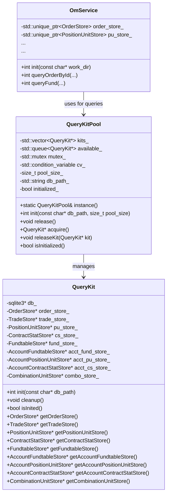
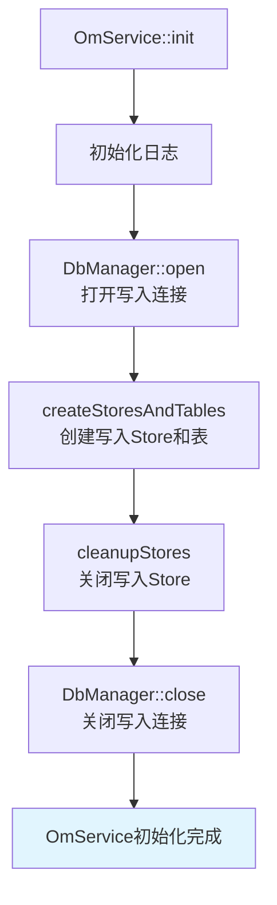
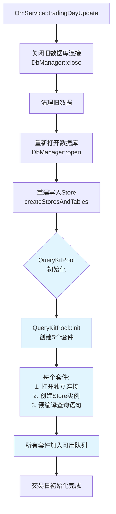
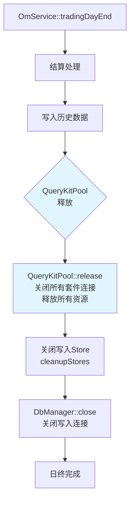
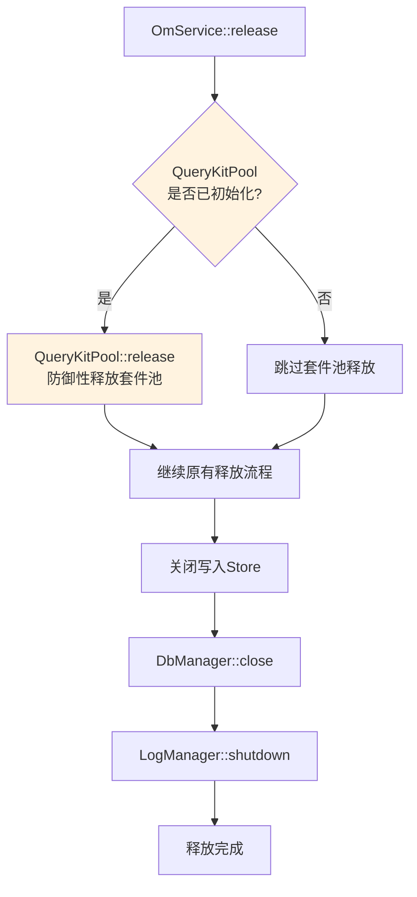

# SQLite查询套件池设计文档

> **版本**: v1.2  
> **日期**: 2026-03-17  
> **状态**: 设计阶段

---

## 1. 设计目标

### 1.1 问题背景

当前Order Manager系统的查询接口直接使用`OmService`中用于写入数据的Store实例进行查询。这在多线程查询场景下存在以下问题：

1. **单连接瓶颈**：所有查询和写入共享同一个SQLite连接，并发性能受限
2. **事务冲突**：写入操作包裹事务时，查询可能被阻塞
3. **线程安全问题**：SQLite连接在多线程环境下需要额外的同步机制

### 1.2 设计目标

1. **读写分离**：查询使用独立的SQLite连接，与写入分离
2. **连接复用**：通过套件池管理多个长连接，避免频繁开闭连接开销
3. **线程安全**：支持多线程并发查询，套件池负责线程安全的套件分配
4. **透明切换**：不修改core层设计，仅在service层调整查询实现

---

## 2. 核心概念

### 2.1 查询套件 (QueryKit)

查询套件是查询的基本单元，包含：

- **独立SQLite连接**：与写入连接分离的只读查询连接
- **完整Store集合**：所有表的Store实例（仅使用查询接口）
- **预编译语句**：初始化时预编译所有查询SQL

```
┌─────────────────────────────────────────┐
│           QueryKit（查询套件）            │
├─────────────────────────────────────────┤
│  sqlite3* db_                          │
├─────────────────────────────────────────┤
│  OrderStore* order_store_                │
│  TradeStore* trade_store_                │
│  PositionUnitStore* pu_store_           │
│  ContractStatStore* cs_store_           │
│  FundtableStore* fund_store_            │
│  ...（所有其他Store）                    │
└─────────────────────────────────────────┘
```

### 2.2 查询套件池 (QueryKitPool)

套件池管理多个套件的生命周期和分配：

- **固定大小**：可配置，默认5个套件
- **线程安全**：支持多线程并发获取/释放套件
- **日初初始化**：仅在`tradingDayUpdate`时初始化，打开独立连接
- **日终释放**：在`tradingDayEnd`时关闭所有连接，释放资源
- **交易日绑定**：生命周期与交易日绑定，交易日切换时重建

```
┌─────────────────────────────────────────┐
│         QueryKitPool（套件池）            │
├─────────────────────────────────────────┤
│  std::vector<QueryKit*> kits_            │
│  std::queue<QueryKit*> available_        │
│  std::mutex mutex_                       │
│  std::condition_variable cv_             │
│  size_t pool_size_                     │
│  std::string db_path_                    │
│  bool initialized_                       │
└─────────────────────────────────────────┘
```

---

## 3. 架构设计

### 3.1 整体架构

```
┌──────────────────────────────────────────────────────────────┐
│                     OmService（业务层）                       │
│  ┌─────────────────┐    ┌─────────────────────────────────┐  │
│  │ 写入Store集合   │    │     QueryKitPool（套件池）       │  │
│  │ (原有，用于写入)│    │  ┌─────────┐ ┌─────────┐ ...     │  │
│  │  - order_store_│    │  │QueryKit0│ │QueryKit1│         │  │
│  │  - pu_store_   │    │  │  (db0)  │ │  (db1)  │         │  │
│  │  - ...         │    │  └─────────┘ └─────────┘         │  │
│  └─────────────────┘    └─────────────────────────────────┘  │
│            │                            │                    │
│            ▼                            ▼                    │
│  ┌─────────────────┐    ┌─────────────────────────────────┐  │
│  │   DbManager     │    │   独立SQLite连接(只读查询)       │  │
│  │  (写入连接)      │    │   - kit0.db                     │  │
│  └─────────────────┘    │   - kit1.db                     │  │
│                         │   - ...                         │  │
│                         └─────────────────────────────────┘  │
└──────────────────────────────────────────────────────────────┘
```

### 3.2 类图



---

## 4. 接口设计

### 4.1 QueryKit类

```cpp
namespace om {

/**
 * @brief 查询套件 - 包含独立的SQLite连接和所有Store实例
 * 
 * 设计原则：
 * 1. 每个套件拥有独立的SQLite连接，与写入连接完全隔离
 * 2. 仅初始化查询所需的预编译语句，不初始化写入语句
 * 3. 套件生命周期由QueryKitPool管理
 */
class QueryKit {
public:
    QueryKit();
    ~QueryKit();

    /**
     * @brief 初始化套件 - 打开数据库连接并预编译查询语句
     * @param db_path 数据库文件路径
     * @return 0成功；负数错误码
     */
    int init(const char* db_path);

    /**
     * @brief 清理套件 - 关闭数据库连接
     */
    void cleanup();

    /**
     * @brief 检查套件是否已初始化
     */
    bool isInited() const;

    // Store访问接口（仅查询用）
    OrderStore* getOrderStore() const;
    TradeStore* getTradeStore() const;
    PositionUnitStore* getPositionUnitStore() const;
    ContractStatStore* getContractStatStore() const;
    FundtableStore* getFundtableStore() const;
    AccountFundtableStore* getAccountFundtableStore() const;
    AccountPositionUnitStore* getAccountPositionUnitStore() const;
    AccountContractStatStore* getAccountContractStatStore() const;
    CombinationUnitStore* getCombinationUnitStore() const;

private:
    QueryKit(const QueryKit&) = delete;
    QueryKit& operator=(const QueryKit&) = delete;

    sqlite3* db_;
    bool inited_;

    // Store实例（裸指针，由QueryKit拥有）
    OrderStore* order_store_;
    TradeStore* trade_store_;
    PositionUnitStore* pu_store_;
    ContractStatStore* cs_store_;
    FundtableStore* fund_store_;
    AccountFundtableStore* acct_fund_store_;
    AccountPositionUnitStore* acct_pu_store_;
    AccountContractStatStore* acct_cs_store_;
    CombinationUnitStore* combo_store_;
};

} // namespace om
```

### 4.2 QueryKitPool类

```cpp
namespace om {

/**
 * @brief 查询套件池 - 管理多个QueryKit的生命周期和分配
 * 
 * 设计原则：
 * 1. 单例模式，全局唯一
 * 2. 线程安全的套件获取/释放
 * 3. 固定大小池，默认5个套件
 * 4. 跟随交易日进行初始化和清理
 */
class QueryKitPool {
public:
    static QueryKitPool& instance();

    /**
     * @brief 初始化套件池
     * @param db_path 数据库文件路径
     * @param pool_size 池大小（默认5）
     * @return 0成功；负数错误码
     * 
     * 初始化流程：
     * 1. 创建pool_size个QueryKit实例
     * 2. 每个套件打开独立连接
     * 3. 执行各Store的stmt预编译
     * 4. 将所有套件加入可用队列
     */
    int init(const char* db_path, size_t pool_size = 5);

    /**
     * @brief 释放套件池
     * 
     * 清理流程：
     * 1. 等待所有套件归还
     * 2. 关闭各套件的数据库连接
     * 3. 释放所有套件实例
     */
    void release();

    /**
     * @brief 获取一个可用套件（线程安全）
     * @return QueryKit指针；nullptr表示池未初始化或正在关闭
     * 
     * 阻塞行为：
     * - 如果有可用套件，立即返回
     * - 如果无可用套件，阻塞等待直到有套件归还
     */
    QueryKit* acquire();

    /**
     * @brief 归还套件到池中（线程安全）
     * @param kit 要归还的套件
     */
    void releaseKit(QueryKit* kit);

    /**
     * @brief 检查池是否已初始化
     */
    bool isInitialized() const;

    /**
     * @brief 获取池大小
     */
    size_t getPoolSize() const;

    /**
     * @brief 获取当前可用套件数
     */
    size_t getAvailableCount() const;

private:
    QueryKitPool();
    ~QueryKitPool();
    QueryKitPool(const QueryKitPool&) = delete;
    QueryKitPool& operator=(const QueryKitPool&) = delete;

    std::vector<QueryKit*> kits_;        // 所有套件
    std::queue<QueryKit*> available_;    // 可用套件队列
    mutable std::mutex mutex_;           // 保护available_队列
    std::condition_variable cv_;         // 套件归还通知
    size_t pool_size_;
    std::string db_path_;
    bool initialized_;
};

} // namespace om
```

---

## 5. 初始化与清理流程

### 5.1 系统初始化流程



**说明**：系统初始化时不创建套件池，因为查询功能在交易日初始化之前不可用。

### 5.2 交易日初始化流程（日初）



**说明**：
1. 交易日初始化时首次创建套件池，或重建已存在的套件池
2. 每个套件打开独立的SQLite只读连接
3. 所有Store预编译查询语句，准备接收查询请求

### 5.3 日终结算流程



**说明**：
1. 日终结算时释放套件池所有资源
2. 所有套件的SQLite连接关闭
3. 套件实例被销毁
4. 下一个交易日初始化时会重新创建套件池

### 5.4 系统释放流程（防御性清理）



**说明**：
1. release()中进行防御性检查，若套件池已初始化则释放
2. 覆盖未调用tradingDayEnd直接release的场景（如测试中途退出、异常终止等）
3. 即使tradingDayEnd已释放过，重复调用release()也是安全的（幂等设计）

---

## 6. 查询接口改造

### 6.1 改造原则

1. **写入接口不变**：`handleOrder`、`handleNewPrice`等仍使用`OmService`中原有的Store
2. **查询接口改造**：保留的`queryXXX`方法（对应 om_query.h 中对外 C API 的实现）改用`QueryKitPool`获取套件进行查询
3. **透明替换**：接口签名不变，调用方无感知

### 6.2 查询方法改造示例

**改造前：**
```cpp
int OmService::queryFund(const char* run_id, const char* account_id,
                         int32_t account_type, const char* strategy_id,
                         Fundtable* out) {
    if (!inited_) return OM_NotInited;
    return fund_store_->queryByScope(run_id, account_id, account_type, 
                                      strategy_id, out);
}
```

**改造后：**
```cpp
int OmService::queryFund(const char* run_id, const char* account_id,
                         int32_t account_type, const char* strategy_id,
                         Fundtable* out) {
    if (!inited_) return OM_NotInited;
    
    // 从套件池获取套件
    QueryKit* kit = QueryKitPool::instance().acquire();
    if (!kit) return OM_NotInited;
    
    // 使用套件中的Store进行查询
    int rc = kit->getFundtableStore()->queryByScope(run_id, account_id, 
                                                    account_type, 
                                                    strategy_id, out);
    
    // 归还套件
    QueryKitPool::instance().releaseKit(kit);
    return rc;
}
```

### 6.3 批量查询优化

对于需要多次查询的场景（如遍历查询），支持在调用方缓存套件：

```cpp
// 批量查询示例
int batchQueryExample() {
    // 获取套件并缓存
    QueryKit* kit = QueryKitPool::instance().acquire();
    if (!kit) return OM_NotInited;
    
    // 执行多次查询
    kit->getOrderStore()->queryByOrderId(...);
    kit->getPositionUnitStore()->queryUnclosedByDirection(...);
    kit->getFundtableStore()->queryByScope(...);
    
    // 批量查询完成后归还套件
    QueryKitPool::instance().releaseKit(kit);
    return OM_Ok;
}
```

---

## 7. 文件结构

### 7.1 模块划分说明

套件相关代码**不放在 data/ 目录**，而是放在独立的 **kit/** 模块中：

- **kit/**：套件模块，用于存放各种套件实现
- **设计原因**：未来可能添加其他类型的套件（如统计套件、导出套件等），kit 模块便于扩展，保持 data 层职责单一（仅数据持久化）

### 7.2 目录结构

```
kit/                                    # 【新增】套件模块
├── query_kit.h/.cc                     # 查询套件
├── query_kit_pool.h/.cc                # 查询套件池
└── （未来可扩展：其他类型套件）

data/                                   # 数据层（保持不变）
├── db_manager.h/.cc                    # 数据库连接管理（写入用）
├── order_store.h/.cc                   # 委托存储
├── trade_store.h/.cc                   # 成交存储
├── position_unit_store.h/.cc           # 持仓单元存储
├── contract_stat_store.h/.cc           # 合约统计存储
├── fundtable_store.h/.cc               # 资金表存储
├── account_fundtable_store.h/.cc       # 账户资金存储
├── account_position_unit_store.h/.cc   # 账户持仓存储
├── account_contract_stat_store.h/.cc   # 账户合约统计
├── combination_unit_store.h/.cc        # 组合持仓存储
└── ...
```

**依赖关系**：kit 模块依赖 data 层（使用 Store 类），不依赖 core/service。

---

## 8. 并发安全说明

### 8.1 SQLite并发特性

- **WAL模式**：本项目已启用WAL模式，支持读写并发
- **读取并发**：多个读取连接可以并发执行，互不阻塞
- **写入串行**：写入操作在WAL模式下仍然需要串行执行

### 8.2 套件池并发策略

| 场景 | 处理方式 |
|------|----------|
| 多个查询并发 | 不同线程获取不同套件，完全并行 |
| 查询与写入并发 | 查询使用独立连接，WAL模式支持下读写互不阻塞 |
| 套件耗尽 | 线程阻塞等待，直到有套件归还 |
| 套件池未初始化 | 返回nullptr，调用方应返回OM_NotInited |

### 8.3 线程安全保证

1. **套件池线程安全**：`acquire()`和`releaseKit()`使用mutex保护
2. **套件非线程安全**：单个套件同一时间只能被一个线程使用（由套件池保证）
3. **SQLite连接线程安全**：每个套件有独立连接，不涉及跨线程使用同一连接

---

## 9. 错误处理

### 9.1 新增错误码

```cpp
// include/om_error.h

// QueryKitPool错误码 (-700 ~ -799)
#define QueryKitPool_NotInited      -701    // 套件池未初始化
#define QueryKitPool_AlreadyInited  -702    // 套件池重复初始化
#define QueryKitPool_InvalidArg     -703    // 参数非法
#define QueryKitPool_DbOpenFailed   -704    // 套件数据库连接打开失败
#define QueryKitPool_StoreInitFailed -705   // 套件Store初始化失败
```

### 9.2 错误传播

| 层级 | 错误来源 | 处理方式 |
|------|----------|----------|
| QueryKit::init | sqlite3_open失败 | 返回QueryKitPool_DbOpenFailed |
| QueryKit::init | Store::init失败 | 返回QueryKitPool_StoreInitFailed |
| QueryKitPool::init | 任一套件初始化失败 | 清理已创建套件，返回错误码 |
| OmService::queryXXX | 套件池未初始化 | 返回OM_NotInited |
| OmService::queryXXX | 获取套件失败 | 返回OM_NotInited |
| OmService::queryXXX | Store查询错误 | 原样返回Store错误码 |

---

## 10. 性能考虑

### 10.1 连接池大小选择

| 并发查询数 | 建议池大小 | 说明 |
|-----------|-----------|------|
| 1-2 | 3 | 留一个备用 |
| 3-5 | 5 | 默认值，适合大多数场景 |
| 6-10 | 8-10 | 高并发查询场景 |
| >10 | 10+ | 需评估SQLite并发性能上限 |

### 10.2 性能优化点

1. **预编译语句复用**：套件内的Store已预编译查询语句，避免重复解析SQL
2. **长连接保持**：套件生命周期内保持连接打开，避免频繁开闭开销
3. **连接数控制**：固定大小池避免创建过多连接导致资源耗尽

---

## 11. 实施计划

### 11.1 实施步骤

1. **创建 kit 模块目录**（若不存在）

2. **创建QueryKit类** (`kit/query_kit.h/.cc`)
   - 封装独立SQLite连接
   - 包含所有Store实例
   - 实现init/cleanup接口

3. **创建QueryKitPool类** (`kit/query_kit_pool.h/.cc`)
   - 实现单例模式
   - 实现线程安全的acquire/release
   - 实现init/release生命周期管理

4. **修改OmService** (`service/om_service.cc`)
   - ~~init()中不初始化套件池~~（查询功能在交易日初始化前不可用）
   - tradingDayUpdate()中增加套件池初始化（首次创建或重建）
   - tradingDayEnd()中增加套件池释放
   - release()中**防御性释放套件池**（防止未调用tradingDayEnd直接release的情况）

5. **改造查询接口** (`service/om_service.cc`)
   - 所有queryXXX方法改用套件池
   - 确保套件正确获取和归还

6. **测试验证**
   - 单线程功能测试
   - 多线程并发查询测试
   - 交易日切换测试

### 11.2 风险与回滚

| 风险 | 缓解措施 |
|------|----------|
| 套件池引入bug | 保留原有查询实现，通过宏开关切换 |
| 性能不达预期 | 可调整池大小或回滚到原有实现 |
| 资源泄漏 | 使用RAII管理套件生命周期 |

---

## 12. 相关文档

| 主题 | 位置 |
|------|------|
| Store层接口 | `03-implementation/interfaces/store-apis.md` |
| 模块架构 | `01-architecture/module-data.md` |
| 查询API | `include/om_query.h` |
| 错误码定义 | `include/om_error.h` |

---

## 13. 修订记录

| 版本 | 日期 | 修改内容 |
|------|------|----------|
| v1.0 | 2026-03-17 | 初始设计文档 |
| v1.1 | 2026-03-17 | 调整套件池生命周期：仅在tradingDayUpdate中初始化，在tradingDayEnd中释放 |
| v1.2 | 2026-03-17 | 套件代码从 data/ 迁至 kit/ 模块，便于未来扩展其他类型套件 |
| v1.3 | 2026-03-17 | 移除 15 个未使用查询接口（queryOrdersByStatus、queryOrdersByCode 等） |
