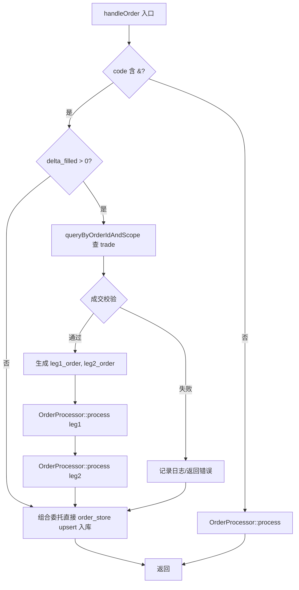
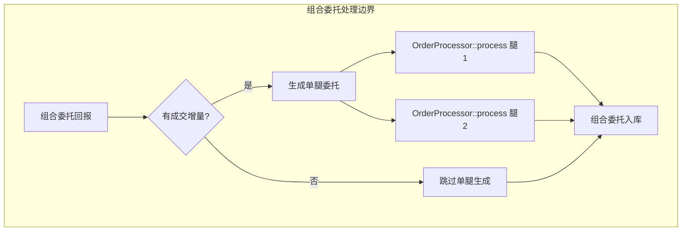

# 组合委托拆分为单腿委托 - 实现规范

> 当组合委托发生成交时，基于 trade 数据生成两个单腿普通委托，用于持仓与资金驱动

---

## 1. 功能概述

当系统接收到**组合委托**的委托回报且**本次发生成交**时，从 trade 数据库读取该委托对应的成交数据，基于组合委托与成交数据**生成两个单腿普通委托**。生成的单腿委托当作普通委托走 `OrderProcessor::process` 驱动持仓与资金计算；原始的组合委托直接入库，不经过 `OrderProcessor::process`。

**关联文档**：
- 组合委托定义：`[02-domain/combination-order.md](../../02-domain/combination-order.md)`
- 成交字段定义：`[02-domain/trade-lifecycle.md](../../02-domain/trade-lifecycle.md)`
- 委托字段定义：`[02-domain/order-lifecycle.md](../../02-domain/order-lifecycle.md)`

---

## 2. 触发条件与调用时机

| 条件 | 判定方法 | 代码位置 |
|------|----------|----------|
| 委托为组合委托 | `code` 包含 `&` 字符 | `OmService::handleOrder` 入口 |
| 本次发生成交 | `delta_filled_volume > 0` | 前置查询后自行计算 |
| 成交数据已入库 | `TradeStore::queryByOrderIdAndScope` 能查到该 `order_id` 的成交 | 成交由 `om_handle_trade` 先行写入 |

**delta_filled_volume 获取时机**：在 `OrderProcessor::process` 之前，`handleOrder` 中先调用 `order_store_->queryByOrderId` 查 combo 历史；若有历史则 `delta = order.filled_volume - stored.filled_volume`，若无历史则 `delta = order.filled_volume`。仅当 `delta > 0` 且 `code` 含 `&` 时，再查 trade 并执行拆分。

**调用流程**：在 `handleOrder` 中做组合委托检测。若为组合委托：有成交则查 trade、校验、生成两腿委托并分别 `OrderProcessor::process`，组合委托直接 `order_store_->upsert` 入库；无成交则仅 `order_store_->upsert` 入库。若为普通委托，则走 `OrderProcessor::process`。

**时序说明**：**需由调用方确保**成交回报先于委托回报推送，本系统不做时序处理或降级。

---

## 3. 组合委托判定规则

| 检验项 | 字段 | 规则 | 实现方法 |
|--------|------|------|----------|
| 组合委托格式 | `order.code` | 包含且仅包含一个 `&`，格式为 `{exchange}.{leg1}&{leg2}` | `strchr(order.code, '&') != nullptr` 且 `&` 前后非空 |
| 第一腿代码 | `order.code` | `&` 前子串，如 `DCE.b2606` | `p = strchr(code, '&')`，第一腿长度 `len1 = p - code`，`strncpy(leg1_code, code, len1)`；leg1 完整含交易所 |
| 第二腿代码 | `order.code` | `&` 后子串，如 `b2612` | 第二腿与第一腿**同市场**：从 `p+1` 开始，补全第一腿的交易所前缀。例：`DCE.b2606&b2612` → leg1=`DCE.b2606`，leg2=`DCE.b2612` |
| 方向合法性 | `order.side` | 为 `Long_Open(3)` 或 `Short_Open(5)` | 开仓组合才参与拆分，平仓组合规则可后续扩展 |

**约定**：第二腿 code 与第一腿同市场，`DCE.b2606&b2612` 拆为 `DCE.b2606` 和 `DCE.b2612`。第一腿 `&` 前含交易所前缀，第二腿 `&` 后补全相同前缀。

---

## 4. 成交数据校验

使用 `TradeStore::queryByOrderIdAndScope(order_id, run_id, account_id, account_type, strategy_id, out)` 查询该组合委托的**全部成交**。组合可能多批成交，需按 `trade.code` 分腿后聚合。

| 检验项 | 规则 | 失败处理 |
|--------|------|----------|
| 成交条数 | 每腿至少 1 条 OmTrade；两腿条数可不等 | 0 条：记录日志并跳过拆分 |
| 腿代码匹配 | 按 `trade.code` 分组到 leg1/leg2，需与解析出的 `leg1_code`、`leg2_code` 匹配 | 不匹配则返回 `OM_ComboLegCodeMismatch` |
| 成交量一致 | `Σ(leg1_trades.volume) == Σ(leg2_trades.volume) == combo.filled_volume` | 不相等则返回 `OM_ComboLegVolumeMismatch` |
| side 合法性 | 各腿的 `trade.side` 符合组合方向映射，且同腿内 side 一致 | 不合法则记录告警或返回错误 |
| 价格有效 | `trade.price > 0`（×10000） | 沿用 `TradeProc_InvalidArg` |
| match_type | 建议仅处理 `TradeReportType_Normal(1)` | 可在文档中约定 |

**组合方向与单腿 side 映射**：

| 组合 order.side | 第一腿 side | 第二腿 side |
|-----------------|-------------|-------------|
| Long_Open (3) | Long_Open (3) | Short_Open (5) |
| Short_Open (5) | Short_Open (5) | Long_Open (3) |

**多批成交聚合**：按 `trade.code` 分腿后，每腿 `filled_volume = Σ(volume)`，`filled_turnover = Σ(filled_turnover)`，`fee = Σ(fee)`。

---

## 5. 单腿委托生成（字段映射表）

以组合委托 `OmOrder combo` 和该腿**聚合后的 OmTrade 数据**为输入，生成两个 `OmOrder leg1_order`、`leg2_order`。

**注意**：`filled_volume`、`filled_turnover`、`fee` 为**累计量**，必须按该腿所有 OmTrade 聚合。

### 5.1 主键字段

| 目标字段 | 腿1 OmOrder | 腿2 OmOrder | 说明 |
|----------|-----------|-----------|------|
| order_id | `{combo.order_id}.1` | `{combo.order_id}.2` | 点号+腿编号，与组合委托区分，LEN_ID=64 |
| oper_date | `combo.oper_date` | 同左 | 继承 |
| strategy_id, run_id, account_id, account_type | 从 combo 继承 | 同左 | |

### 5.2 业务字段

| 目标字段 | 腿1 OmOrder | 腿2 OmOrder | 说明 |
|----------|-----------|-----------|------|
| code | 该腿 OmTrade 的 code（或解析出的 leg1_code） | 同左 | 单腿合约代码 |
| volume | `combo.volume` | 同左 | 委托总量 |
| **filled_volume** | **Σ(该腿所有 OmTrade.volume)** | 同左 | **累计**已成交手数 |
| **filled_turnover** | **Σ(该腿所有 OmTrade.filled_turnover)** | 同左 | **累计**已成交金额（×10000） |
| **fee** | **Σ(该腿所有 OmTrade.fee)** | 同左 | **累计**手续费（×10000） |
| price | 成交量加权均价：`Σ(filled_turnover)/Σ(volume)/multiply` | 同左 | 委托价用成交价近似 |
| contract_multiply | FeeCodeInfo(leg_code).multiply | 同左 | 必须从 FeeCodeInfo 取 |
| margin_ratio | CalcHelper::selectMarginRatio(FeeCodeInfo(leg_code), direction, hedge_flag) | 同左 | 按单腿 FeeCodeInfo 计算 |
| side | 该腿 OmTrade 的 side（已校验） | 同左 | |
| status | `combo.status` | 同左 | |
| market | `combo.market` 或按 code 推导 | 同左 | |
| frozen | 0 | 0 | 已成交无挂单 |
| cancel_volume | `combo.cancel_volume` | 同左 | 直接继承 |
| cl_order_id | `{combo.cl_order_id}.1` | `{combo.cl_order_id}.2` | 点号+腿编号，LEN_CODE=32，需长度校验 |
| product | 该腿 OmTrade.product 或 FeeCodeInfo | 同左 | |
| date, create_time, update_time, finish_time | 从 combo 继承或取当前时间 | 同左 | |
| order_type, hedge_flag | 从 combo 继承 | 同左 | |

### 5.3 单腿 order_id 生成规则

单腿委托的 `order_id` 由**组合委托 `order_id` + 点号 + 腿编号**拼接而成：

```
leg1.order_id = combo.order_id + ".1"
leg2.order_id = combo.order_id + ".2"
```

**示例**：

| 组合委托 order_id | 第一腿 order_id | 第二腿 order_id |
|-------------------|-----------------|-----------------|
| `1000`            | `1000.1`        | `1000.2`        |
| `ORD_20260315_001`| `ORD_20260315_001.1` | `ORD_20260315_001.2` |

**设计约定**：

- 点号（`.`）作为分隔符，使单腿 `order_id` 与组合 `order_id` 之间存在可见的层级关系
- `.1` 对应第一腿（`&` 前的合约），`.2` 对应第二腿（`&` 后的合约）
- 腿编号固定为 `.1` / `.2`，不随成交批次变化；多批成交时每次生成的单腿 `order_id` 相同，走 `upsert` 更新
- `cl_order_id` 采用相同规则：`{combo.cl_order_id}.1` / `{combo.cl_order_id}.2`
- 拼接后总长度不超过 `LEN_ID=64`（`order_id`）及 `LEN_CODE=32`（`cl_order_id`），若超长需截断或返回错误

### 5.4 组合持仓配对（CombinationUnit 创建）

两腿单腿委托经 `OrderProcessor::process` 处理后，`OmService::handleCombinationOrder` 额外执行配对步骤，将两腿的 `AccountPositionUnit` 两两绑定为 `CombinationUnit`。

**配对流程**：

两腿 process 完成后，各自产生 N 条未配对 AccountPositionUnit（combination_id=0）。配对步骤：
1. 分别按 order_id 查询两腿未配对持仓（按 id 升序）
2. 逐手创建 CombinationUnit 记录，关联两腿 position_unit_id_a/b
3. 回填两腿持仓的 combination_id

**多批次成交**：查询条件为 `order_id='1000.1' AND combination_id=0`，精确捞取本批次未配对持仓，不影响已配对的历史批次。

---

### 5.5 平仓 FIFO 优先级规则

当同一合约同时存在**普通持仓**（`combination_id=0`）和**组合腿持仓**（`combination_id≠0`）时，平仓按以下优先级匹配：

```
优先级 1：combination_id = 0   （普通单腿委托产生的持仓，优先平）
优先级 2：combination_id ≠ 0   （组合委托拆分产生的持仓，后平）

同优先级内按原有 FIFO 规则（open_date ASC, open_time ASC）
```

**设计理由**：组合持仓两腿通常需要同步操作，单独平一腿会破坏组合结构，因此优先消耗普通持仓，保护组合完整性。

**排序约定**：`queryUnclosedByDirection` 按 combination_id=0 优先（普通持仓先平）、open_date/time/id 升序

---

## 5.6 平仓打破组合逻辑

当账户级平仓成交平到组合持仓时（`combination_id ≠ 0`），系统自动打破该持仓对对应的组合。

### 5.6.1 处理位置

`AccountPositionProcessor::onCloseFill` 中，在 `batchUpdateClose` 之后执行：

**处理流程**：

```
如果 combo_store 存在：
    1. 收集被平仓的组合持仓信息
       遍历本次平仓涉及的持仓单元：
           如果 combination_id != 0（是组合持仓）：
               查询对应的 CombinationUnit，确定另一腿持仓
               加入待打破组合列表
    
    2. 执行打破组合操作
       对于每个待打破的组合：
           标记组合已拆分（breakCombination，设置 existed_flag=0，break_time）
           释放另一腿的 combination_id（设为 0，变为普通持仓）
```

### 5.6.2 数据变化示例

**平仓前状态**：

```
AccountPositionUnit 表:
├─ id=1, code=leg1, combination_id=101  ← 持仓对1的腿1
├─ id=2, code=leg2, combination_id=101  ← 持仓对1的腿2
├─ id=3, code=leg1, combination_id=102  ← 持仓对2的腿1（将被平掉）
├─ id=4, code=leg2, combination_id=102  ← 持仓对2的腿2
└─ id=5, code=leg1, combination_id=103  ← 持仓对3的腿1

CombinationUnit 表:
├─ id=101, leg_a=1, leg_b=2, existed_flag=1
├─ id=102, leg_a=3, leg_b=4, existed_flag=1  ← 将被打破
└─ id=103, leg_a=5, leg_b=6, existed_flag=1
```

**平仓后状态**（平仓委托平掉 id=3 的持仓）：

```
AccountPositionUnit 表:
├─ id=3, close_date=20260315, combination_id=102  ← 已平仓
├─ id=4, combination_id=0                         ← 释放为普通持仓
└─ 其他持仓不变

CombinationUnit 表:
├─ id=102, existed_flag=0, break_time=20260315143025500  ← 已拆分
└─ 其他组合对不变
```

### 5.6.3 设计要点

1. **一手对一手**：每个 `CombinationUnit` 只管理一对持仓，平仓只打破被平的那个对
2. **独立影响**：开仓 N 手产生 N 个独立 Unit，平仓不影响其他 Unit
3. **仅释放另一腿**：当前平仓腿已在 `batchUpdateClose` 中关闭，只需释放另一腿
4. **错误隔离**：打破组合失败记录日志，不影响平仓主流程

---

## 6. ComboOrderService 实现详解

### 6.1 类设计与依赖注入

**依赖注入**（构造函数传入）：
- order_proc：OrderProcessor，处理单腿委托
- order_store：OrderStore，查询和更新委托
- trade_store：TradeStore，查询成交
- acct_pu_store：AccountPositionUnitStore，查询未配对持仓
- combo_store：CombinationUnitStore，创建组合单元
- fee_cache：费率缓存，获取合约乘数和保证金率

**主要接口**：
- handleInTx(order, fee_info)：处理组合委托（假定已在事务内）
- isCombinationOrder(code)：检查 code 是否含 &，判断是否为组合委托

### 6.2 handleInTx() 处理流程

**流程概述**：

```
Step 1: 解析两腿合约代码
    - 从组合 code（如 DCE.b2606&b2612）解析出 leg1_code 和 leg2_code
    - 校验格式合法性（含且仅含一个 &，腿代码非空）

Step 2: 计算本次成交增量
    - 查询该委托已存储的 filled_volume
    - delta_volume = order.filled_volume - stored.filled_volume

Step 3: 如果有成交增量（delta_volume > 0），处理拆腿
    3.1 查询该委托的所有成交（TradeStore::queryByOrderIdAndScope）
    
    3.2 校验并聚合成交
        - 按 trade.code 分腿聚合成交量、成交额、手续费
        - 校验：两腿成交量相等且等于组合委托 filled_volume
        - 校验：成交 code 与解析出的腿代码匹配
        - 根据组合方向推导两腿 side
    
    3.3 生成并处理第一腿委托
        - 单腿 order_id = combo_order_id + ".1"
        - 从 fee_cache 获取该腿合约信息
        - 调用 OrderProcessor::process 处理开仓
    
    3.4 生成并处理第二腿委托
        - 单腿 order_id = combo_order_id + ".2"
        - 同样流程处理第二腿
    
    3.5 配对两腿持仓创建 CombinationUnit
        - 查询该委托创建的两腿未配对 AccountPositionUnit
        - 逐手创建 CombinationUnit 记录
        - 更新持仓单元的 combination_id 字段

Step 4: 组合委托入库
    - 无论是否拆腿，都将原始组合委托 upsert 到 order 表
    - 组合委托本身不经过 OrderProcessor，仅作为记录存档
```

### 6.3 关键私有方法说明

#### parseComboLegs() - 解析两腿代码

**输入**: `DCE.b2606&b2612`  
**输出**: `leg1_code=DCE.b2606`, `leg2_code=DCE.b2612`  
**逻辑**: 
- 查找 `&` 位置分割字符串
- 第二腿补全第一腿的交易所前缀（如 `DCE.`）
- 校验格式合法性

#### calcComboDeltaVolume() - 计算成交增量

**逻辑**: 
- 查询该委托已存储状态
- delta_volume = 当前 filled_volume - 已存储 filled_volume
- 首次处理时 delta_volume = 当前 filled_volume

#### validateAndAggregateTrades() - 校验并聚合成交

**逻辑**:
- 根据组合方向推导两腿 side（Long_Open → leg1多/leg2空）
- 按 trade.code 分腿聚合成交量、成交额、手续费
- 校验两腿成交量相等且等于组合委托 filled_volume
- 校验所有成交 code 与解析出的腿代码匹配

#### generateLegOrder() - 生成单腿委托

**字段映射**:
- 主键字段：order_id = `{combo.order_id}.1/.2`，其余从组合继承
- 业务字段：code=腿代码，filled_volume=腿成交量，side=腿方向
- 合约信息：从 fee_cache 获取 contract_multiply、margin_ratio
- 价格：成交额 / 成交量 / 合约乘数

#### pairComboLegPositions() - 配对持仓创建组合单元

**逻辑**:
- 查询该委托创建的两腿未配对 AccountPositionUnit
- 校验两腿数量与 delta_volume 一致
- 逐手创建 CombinationUnit 记录（position_unit_id_a/b）
- 更新持仓单元的 combination_id 字段指向新创建的 CU

---

## 7. 错误处理与错误码

| 错误码 | 值 | 说明 |
|--------|-----|------|
| OM_ComboLegCodeMismatch | -610 | 成交 code 与组合腿不匹配 |
| OM_ComboLegVolumeMismatch | -611 | 两腿成交量不一致 |
| OM_ComboTradeNotFound | -612 | 组合委托无对应成交 |
| OM_ComboInvalidFormat | -613 | 组合委托格式非法 |

---

## 8. 与现有流程的集成



**已明确**：
- **生成的单腿委托**：当作普通单腿委托，分别调用 `OrderProcessor::process(leg1)`、`OrderProcessor::process(leg2)`，驱动持仓与资金计算。
- **原始的组合委托**：直接 `order_store_->upsert(combo)` 入库，**不经过** `OrderProcessor::process`。

---

### 8.1 核心设计原则

**明确约定**：组合委托本身**不经过** `OrderProcessor::process`，系统仅做两件事：

1. **条件满足时生成单腿委托**：当 `delta_filled_volume > 0` 时，基于 trade 数据生成两个单腿普通委托
2. **写入数据库**：无论是否执行了第1步，原始组合委托都必须通过 `order_store_->upsert()` 入库（新增或更新）



**注意**：
- 生成的单腿委托走完整的 `OrderProcessor::process` 流程（含持仓、资金、冻结等全部计算）
- 原始组合委托**不走** `OrderProcessor::process`，仅作为记录存档
- 单腿委托的 `order_id` 格式为 `{combo_order_id}.1` 和 `{combo_order_id}.2`（详见 §5.3）
- 无论成交处理成功或失败（只要数据库操作成功），组合委托本身都要入库

---

## 9. 依赖与前置条件

| 依赖 | 说明 |
|------|------|
| TradeStore | `queryByOrderIdAndScope` 已实现 |
| OrderStore | 持久化单腿委托需 `upsert` |
| fee_info_cache_ | 含两腿 code 的 FeeCodeInfo |
| 交易时序 | **需由调用方确保**成交回报先于委托回报推送，本系统不做时序处理或降级 |

**FeeCodeInfo 获取**：生成的单腿委托需各自腿的 `FeeCodeInfo`，来源为 `fee_info_cache_[leg_code]`。调用方需在 `om_trading_day_update` 成功后通过 `om_add_fee_info` 传入，或组合委托处理前确保两腿 `FeeCodeInfo` 已缓存。若某腿缺失，可返回 `OM_MissingFeeInfo`。

---

## 10. 示例：DCE.b2606&b2612 拆分

组合委托：`code="DCE.b2606&b2612"`，`side=Long_Open`，`volume=10`，`filled_volume=5`

解析结果：
- leg1_code = `DCE.b2606`
- leg2_code = `DCE.b2612`

OmTrade 数据（假设 2 条）：
- Trade1: code=`DCE.b2606`，side=`Long_Open`，volume=5，price=35500000，filled_turnover=...
- Trade2: code=`DCE.b2612`，side=`Short_Open`，volume=5，price=36000000，filled_turnover=...

生成的单腿委托：
- leg1_order: order_id=`{combo_id}.1`，code=`DCE.b2606`，side=`Long_Open`，volume=10，filled_volume=5，...
- leg2_order: order_id=`{combo_id}.2`，code=`DCE.b2612`，side=`Short_Open`，volume=10，filled_volume=5，...

---
