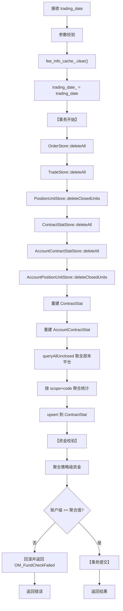

# 流程：交易日初始化（om_trading_day_update）

> 从 old_docs/modules/mod_core.md §4.4 迁移  
> 入口：OmService::tradingDayUpdate(trading_date)  
> 合约基础信息通过 om_add_fee_info 逐个传入，不在本流程内

---

## 1. 流程概述



---

## 2. TradingDayInitService 实现结构

### 2.1 依赖注入设计

**TradingDayInitDeps 结构**：封装交易日初始化所需的全部数据层依赖

```
输入参数：
- trading_date：当前交易日

数据层 Store 指针（全部由调用方传入）：
- order_store, pu_store, cs_store
- acct_pu_store, acct_cs_store
- trade_store, combo_store
- fund_store, acct_fund_store
```

**约定**：run() 在已有事务内执行，不负责 begin/commit/rollback

### 2.2 四大步骤概览

| 步骤 | 方法名 | 职责 | 关键操作 |
|-----|-------|------|---------|
| Step 1 | `cleanupDailyData()` | 清理当日数据 | 删除 order/trade/closed_position/contract_stat/combo |
| Step 2 | `rebuildStrategyContractStats()` | 重建策略级合约统计 | queryAllUnclosed → 按 scope+code 聚合 → upsert |
| Step 3 | `rebuildAccountContractStats()` | 重建账户级合约统计 | 类似策略级，聚合 AccountContractStat |
| Step 4 | `validateAccountFunds()` | 账户资金校验 | 聚合策略级资金，校验 >= 账户级 |

### 2.3 模板化合约统计重建

**设计**：使用 rebuildContractStatsImpl 模板消除策略级/账户级的重复代码，通过函数对象注入不同层级的查询、upsert、key 生成和 Stat 初始化逻辑。

---

## 3. 详细步骤

### Step 0：参数校验（纯内存，事务外）

**逻辑**：校验 trading_date 为合法 YYYYMMDD 格式，否则返回 OM_InvalidArg。

### Step 0.5：清空合约基础信息缓存（OmService层）

**操作**：清空 fee_info_cache_（合约信息需通过 om_add_fee_info 逐个传入）

### Step 1：cleanupDailyData() - 清理当日数据

**处理流程**：

```
1. 清空全部委托记录（order_store->deleteAll）

2. 移除已平仓持仓（close_date > 0）
   - 策略级：pu_store->deleteClosedUnits
   - 账户级：acct_pu_store->deleteClosedUnits

3. 清空合约统计
   - 策略级：cs_store->deleteAll
   - 账户级：acct_cs_store->deleteAll

4. 清空全部成交记录（trade_store->deleteAll）

5. 删除已拆分组合单元（combo_store->deleteByExistedFlag(0)）
```

### Step 2：rebuildStrategyContractStats() - 重建策略级合约统计

**处理流程**：

```
1. 查询全部未平仓 PositionUnit

2. 按 (run_id + account_id + account_type + strategy_id + code) 聚合统计
   对于每个持仓单元：
       - 如果是今仓 (open_date == trading_date)：
           Long → today_long_volume++
           Short → today_short_volume++
       - 如果是昨仓：
           Long → yesterday_long_volume++
           Short → yesterday_short_volume++

3. 将聚合结果 upsert 到 ContractStat 表

设计特点：
- 使用模板化实现（rebuildContractStatsImpl）复用于策略级和账户级
- 通过函数对象注入不同层级的查询和初始化逻辑
```

### Step 3：rebuildAccountContractStats() - 重建账户级合约统计

**处理流程**（与策略级类似）：

```
1. 查询全部未平仓 AccountPositionUnit

2. 按 (run_id + account_id + account_type + code) 聚合统计
   注意：账户级不包含 strategy_id 维度

3. 将聚合结果 upsert 到 AccountContractStat 表
```

**与策略级的区别**：
- 操作 AccountPositionUnit/AccountContractStat
- 聚合 key 不含 strategy_id
- 使用相同的模板化实现

### Step 4：validateAccountFunds() - 账户资金校验

**处理流程**：

```
1. 查询所有账户级资金记录

2. 查询所有策略级资金记录

3. 按账户作用域聚合策略级资金
   对于每个策略级资金：
       按 (run_id + account_id + account_type) 分组累加
       agg_map[key].avail_cash += fund.avail_cash
       agg_map[key].margin += fund.margin
       agg_map[key].equity += fund.equity

4. 校验每个账户级资金 >= 聚合值
   对于每个账户级资金：
       校验 account_cash >= aggregated_avail_cash
       校验 account_margin >= aggregated_margin
       校验 account_equity >= aggregated_equity
       任一不通过返回 OM_FundCheckFailed

5. 记录校验通过的账户数
```

**设计目的**：
- 确保账户级资金充足，能覆盖所有策略级资金需求
- 风控约束：账户可用 >= 各策略可用之和，保证金和权益同理

### Step 5：OmService 层事务控制

**处理流程**：

```
1. 参数校验（trading_date 合法性）

2. 填充 TradingDayInitDeps 结构体
   - trading_date
   - 各 Store 指针（从 DbManager 获取）

3. 【事务开始】beginTransaction

4. 调用 TradingDayInitService::run(deps)
   如果失败则 rollback 并返回错误

5. 【事务提交】commit
   如果失败则 rollback 并返回 DbManager_TxError
```

---

## 4. FeeCodeInfo 缓存策略

| 缓存内容 | 来源 | 用途 | 更新规则 |
|---------|------|------|----------|
| 合约基础信息（合约乘数、保证金率） | om_add_fee_info / addFeeInfo 逐个传入 | 日终结算重算保证金 | 每日初 tradingDayUpdate 时清空，需调用方在初始化成功后按持仓 codes 遍历传入 |
| 当日实际手续费率 | handleOrder 传入 | 委托时计算 frozen/fee | 不缓存，每笔委托独立 |

### 关键设计约束

1. 交易日初始化时 `tradingDayUpdate` 仅清空 `fee_info_cache_`，不接收 fee_infos
2. 调用方应在 `om_trading_day_update` 成功后，通过 `om_add_fee_info` 逐个传入各合约 FeeCodeInfo
3. 委托时传入的 `FeeCodeInfo` 必须含当日实际手续费率
4. 委托传入的手续费率**不会**更新日初缓存的合约基础信息
5. 日终结算仅使用日初缓存的基础信息

---

## 5. ContractStat 重建规则

### 统计逻辑

```
对于每个持仓单元：
    确定 key = run_id + account_id + account_type + [strategy_id] + code
    
    如果是今仓（open_date == trading_date）：
        Long 方向 → today_long_volume++
        Short 方向 → today_short_volume++
    
    如果是昨仓（open_date < trading_date）：
        Long 方向 → yesterday_long_volume++
        Short 方向 → yesterday_short_volume++
```

（注：账户级统计不含 strategy_id 维度）

### 冻结量

新交易日初始化时，`frozen` 字段全部清零（新日无待成交平仓单）。

---

## 6. 数据变更汇总

| 步骤 | 数据表 | 操作 |
|------|--------|------|
| deleteAll | order | DELETE FROM order |
| deleteAll | trade | DELETE FROM trade |
| deleteByExistedFlag | combination_unit | DELETE WHERE existed_flag = 0 |
| deleteClosedUnits | position_unit | DELETE WHERE close_date > 0 |
| deleteClosedUnits | account_position_unit | DELETE WHERE close_date > 0 |
| deleteAll | contract_stat | DELETE FROM contract_stat |
| deleteAll | account_contract_stat | DELETE FROM account_contract_stat |
| upsert | contract_stat | 重建策略级统计记录 |
| upsert | account_contract_stat | 重建账户级统计记录 |
| query+校验 | fundtable + account_fundtable | 校验账户级 >= 策略级聚合值 |

---

## 7. 事务控制

**必须包裹事务**：`tradingDayUpdate` **必须在事务中执行**

**理由**：
- 涉及先删除后重建的操作序列
- 中间失败会产生无法自愈的数据破坏
- 需要保证原子性：要么全部完成，要么全部回滚
- 资金校验失败时事务回滚，防止不一致状态

## 8. 资金校验约束

### 8.1 校验逻辑

交易日初始化时，必须确保账户级资金满足风控约束：

```
account_cash   >= Σ(avail_cash)   // 账户可用资金 >= 各策略可用资金之和
account_margin >= Σ(margin)       // 账户保证金 >= 各策略保证金之和  
account_equity >= Σ(equity)       // 账户权益 >= 各策略权益之和
```

### 8.2 错误处理

| 错误码 | 值 | 触发条件 |
|--------|-----|----------|
| OM_FundCheckFailed | -13 | 账户级资金低于策略级聚合值 |

### 8.3 调用方责任

调用方（如场景测试）需确保：
1. 先调用 `om_set_fund_config` 初始化策略级资金
2. 再调用 `om_set_account_fund_config` 初始化账户级资金
3. 账户级资金值应 >= 对应策略级资金之和

---

## 9. 相关文档

| 主题 | 位置 |
|------|------|
| FeeCodeInfo 设计 | `01-architecture/module-service.md` §费率缓存策略 |
| ContractStat 模型 | `02-domain/position-model.md` |
| Store 接口 | `03-implementation/interfaces/store-apis.md` |
