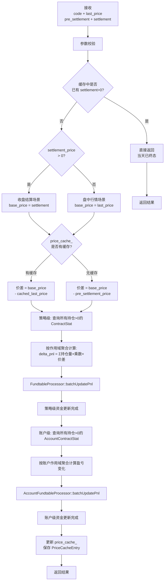

# 流程：行情刷新（om_handle_newprice）

> 版本：v3.0（结算价支持版）  
> 入口：OmService::handleNewPrice(code, last_price, pre_settlement_price, settlement_price)  
> 新增功能：支持结算价计算、终态判断、昨结算价基准

---

## 1. 流程概述

### 1.1 版本演进

| 维度 | v1.0 | v2.0（性能优化版） | v3.0（结算价支持版） |
|------|------|---------------|---------------|
| 计算方式 | 逐手查询PositionUnit | 基于ContractStat和价差 | 基于ContractStat，支持结算价 |
| 入参 | code, last_price | code, last_price | code, last_price, pre_settlement_price, settlement_price |
| 终态判断 | 无 | 无 | **缓存中已有结算价时直接返回** |
| 基准价格 | 无缓存时昨结算价=最新价 | 无缓存时prev_price=last_price | **无缓存时使用pre_settlement_price** |
| 结算场景 | 不支持 | 不支持 | **settlement_price>0时使用结算价计算** |

### 1.2 结算价逻辑

| 场景 | settlement_price | 基准价格 | 价差计算 |
|------|------------------|----------|----------|
| 盘中行情 | 0 | last_price | 有缓存：`last_price - cached_last`<br>无缓存：`last_price - pre_settlement` |
| 收盘结算 | >0 | settlement_price | 有缓存：`settlement - cached_last`<br>无缓存：`settlement - pre_settlement` |
| 已终态（重复调用） | >0（缓存中已存在） | - | **直接返回，不做处理** |

### 1.3 新流程图



---

## 2. 核心计算公式

### 2.1 盈亏变化计算（基于ContractStat）

```cpp
// 1. 获取总持仓量（从 ContractStat）
int32_t long_volume  = today_long_volume + yesterday_long_volume;
int32_t short_volume = today_short_volume + yesterday_short_volume;

// 2. 确定基准价格和对比价格
int64_t base_price;        // 结算场景用settlement_price，盘中用last_price
int64_t prev_price;        // 有缓存用cached_last_price，无缓存用pre_settlement_price

// 3. 计算价差
int64_t price_diff = base_price - prev_price;

// 4. 盈亏变化计算
// 多头：价格上涨盈利，下跌亏损（方向系数 +1）
// 空头：价格下跌盈利，上涨亏损（方向系数 -1）
int64_t delta_pnl = (int64_t)(long_volume - short_volume) 
                    * multiply * price_diff;

// 结果已为扩大一万倍的金额（因为price_diff已扩大一万倍）
```

### 2.2 四种盈亏计算场景

| 场景 | 条件 | 价差公式 | 说明 |
|------|------|----------|------|
| 盘中-有缓存 | settlement==0, has_cached | `last_price - cached_last` | 正常行情更新 |
| 盘中-无缓存 | settlement==0, !has_cached | `last_price - pre_settlement` | 首次行情（开盘） |
| 收盘-有缓存 | settlement>0, has_cached | `settlement - cached_last` | 收盘结算 |
| 收盘-无缓存 | settlement>0, !has_cached | `settlement - pre_settlement` | 直接传入结算价 |

---

## 3. 详细步骤

### 步骤 1：参数校验

**流程**：校验 code 非空、last_price ≥ 0、pre_settlement_price ≥ 0、settlement_price ≥ 0，否则返回 OM_InvalidArg

### 步骤 2：终态判断

**流程**：
1. 从 `price_cache_` 查找该合约缓存
2. 若缓存存在且 `settlement_price > 0`，说明当天已收盘结算过
3. **直接返回 OM_Ok，不做任何处理**

### 步骤 3：确定基准价格和对比价格

**流程**：
1. 判断是否为结算场景：`is_settlement = (settlement_price > 0)`
2. 确定基准价格：`base_price = is_settlement ? settlement_price : last_price`
3. 判断是否有缓存：`has_cached = (缓存中存在该合约)`
4. 确定对比价格：
   - 有缓存：`prev_price = cached.last_price`
   - 无缓存：`prev_price = pre_settlement_price`

### 步骤 4：计算价差

**流程**：`price_diff = base_price - prev_price`

- 若 `price_diff == 0`，盈亏变化为0，可跳过计算

### 步骤 5：策略级盈亏计算（基于ContractStat）

**流程**：调用 `pos_proc_->calcPnlDeltaByContractStat(code, last_price, base_price, is_settlement, has_cached, cached_last_price, pre_settlement_price, fee_info, deltas)`

**calcPnlDeltaByContractStat 内部**：
1. 按 code 查询全部持仓量>0的 ContractStat（跨作用域）
2. 对每个 ContractStat 计算盈亏变化：
   - `long_vol = today_long + yesterday_long`
   - `short_vol = today_short + yesterday_short`
   - `net_position = long_vol - short_vol`
   - `delta = net_position × multiply × price_diff`
3. 按作用域（run_id/account_id/account_type/strategy_id）聚合 delta_pnl
4. 返回 ScopePnlDelta 列表（不更新 PositionUnit.pnl）

### 步骤 6：策略级资金更新

**流程**：将 deltas 转为 FundPnlDelta 数组，调用 `fund_proc_->batchUpdatePnl(fund_deltas)`

**说明**：批量更新多作用域 Fundtable.pnl 和 equity

### 步骤 7：账户级盈亏计算（基于AccountContractStat）

**流程**：调用 `acct_pos_proc_->calcPnlDeltaByContractStat(code, last_price, base_price, is_settlement, has_cached, cached_last_price, pre_settlement_price, fee_info, acct_deltas)`

**逻辑与策略级相同**，仅作用域不含 strategy_id

### 步骤 8：账户级资金更新

**流程**：将 acct_deltas 转为 FundPnlDelta 数组，调用 `acct_fund_proc_->batchUpdatePnl(acct_fund_deltas)`

### 步骤 9：更新价格缓存

**流程**：构建 `PriceCacheEntry` 并写入 `price_cache_[code]`

```cpp
PriceCacheEntry entry;
entry.last_price = last_price;                      // 最新价
entry.pre_settlement_price = pre_settlement_price;    // 昨结算价
entry.settlement_price = settlement_price;          // 今结算价（收盘时>0）
price_cache_[code] = entry;
```

---

## 4. 数据变更汇总

### 4.1 内存缓存结构变更

| 版本 | 缓存类型 | 缓存内容 |
|------|----------|----------|
| v2.0 | `std::unordered_map<std::string, int64_t>` | 仅 last_price |
| v3.0 | `std::unordered_map<std::string, PriceCacheEntry>` | last_price, pre_settlement_price, settlement_price |

### 4.2 PriceCacheEntry 结构

```cpp
struct PriceCacheEntry {
    int64_t last_price;              // 最新价（扩大一万倍）
    int64_t pre_settlement_price;    // 昨结算价（扩大一万倍）
    int64_t settlement_price;        // 今结算价（扩大一万倍，0表示未收盘）
};
```

### 4.3 数据表变更

| 层级 | 数据表 | v2.0 | v3.0 |
|------|--------|------|------|
| 策略级 | position_unit | 不再更新 pnl | 不再更新 pnl（不变） |
| 策略级 | contract_stat | 仅查询 | 仅查询（不变） |
| 策略级 | fundtable | pnl、equity 更新 | pnl、equity 更新（不变） |
| 账户级 | account_position_unit | 不再更新 pnl | 不再更新 pnl（不变） |
| 账户级 | account_contract_stat | 仅查询 | 仅查询（不变） |
| 账户级 | accountfundtable | account_pnl、account_equity 更新 | account_pnl、account_equity 更新（不变） |

### 4.4 缓存生命周期

| 缓存 | 类型 | 清空时机 | 说明 |
|------|------|----------|------|
| `price_cache_` | `PriceCacheEntry` | 1. `tradingDayUpdate()` 新交易日初始化前<br>2. `tradingDayEnd()` 日终结算后（由`release()`调用） | 每日开始时清空，重新累积当日价格数据 |
| `fee_info_cache_` | `FeeCodeInfo` | 1. `tradingDayUpdate()` 新交易日初始化前<br>2. `tradingDayEnd()` 日终结算后（由`release()`调用） | 每日开始时清空，需重新通过`om_add_fee_info`传入 |

**重要说明**：
- `price_cache_` 在交易日初始化时清空，确保昨结算价和今结算价不会跨日混淆
- `fee_info_cache_` 在交易日初始化时清空，确保合约费率信息按当日持仓重新加载
- 日终结算后两个缓存均被清空，系统进入非交易状态

---

## 5. 事务控制

**策略**：`handleNewPrice` **使用事务包裹**

- 流程：`BEGIN` → 步骤5-8（盈亏计算和资金更新） → `COMMIT`
- 任一步失败则 `ROLLBACK`
- 步骤2（终态判断）在事务外，避免不必要的事务开销

---

## 6. 关键设计决策

### 6.1 终态判断前置

**决策**：在开启事务前检查缓存中是否已有结算价

**理由**：
- 避免不必要的事务开销
- 结算后重复调用应快速返回
- 当天盈亏已定格，不应再变化

### 6.2 昨结算价作为无缓存基准

**决策**：首次行情（无缓存）时使用昨结算价作为对比基准

**理由**：
- 昨结算价是前一日收盘的公允价格
- 持仓成本在结算后已更新为昨结算价
- 避免使用最新价导致首次盈亏为0

### 6.3 结算价覆盖最新价

**决策**：收盘结算时以结算价为准，不使用最新价

**理由**：
- 结算价是交易所官方公布的当日收盘价
- 用于日终盯市盈亏计算
- 与期货行业惯例一致

---

## 7. 相关文档

| 主题 | 位置 |
|------|------|
| 对外API接口 | `03-implementation/interfaces/public-apis.md` §3.2 |
| Processor接口 | `03-implementation/interfaces/processor-apis.md` §2 |
| 盈亏计算公式 | `02-domain/calc-formulas.md` §行情盈亏变化计算 |
| 持仓模型 | `02-domain/position-model.md` |
| 资金模型 | `02-domain/fund-model.md` |
| 性能测试场景 | `03-implementation/scenarios/scenario15.md` |

---

## 8. 修订记录

| 日期 | 版本 | 说明 |
|------|------|------|
| 2026-03-18 | v3.0 | 结算价支持版：增加pre_settlement_price和settlement_price参数，支持终态判断和结算价计算 |
| 2026-03-18 | v2.0 | 性能优化版：改为基于ContractStat和价差计算盈亏差额 |
| 2026-03-14 | v1.0 | 初始版本：逐手计算盈亏 |
