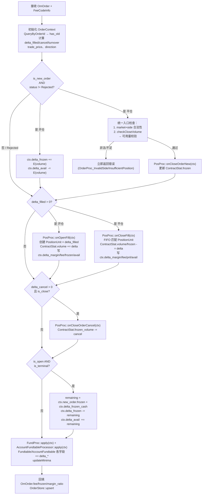

# 流程：委托处理（om_handle_order）

> 从 old_docs/modules/mod_core.md §4.1 迁移  
> 入口：OrderProcessor::process(order, fee_info)

---

## 1. 流程概述

---

## 2. 详细步骤

### Step 1：初始化 OrderContext

**流程**：
1. 拷贝 order 到 ctx.new_order，设置 fee_code_info
2. 按主键查询 OrderStore，有历史则 ctx.has_old=1
3. 若有历史：从 stored_order 预填 fee/frozen/margin_ratio；计算 delta_filled、delta_cancel、delta_turnover；任一 delta<0 则返回 OrderProc_InvalidState
4. 若无历史：delta 直接取 order 的 filled/cancel/turnover
5. 若有成交增量：trade_price = delta_turnover / delta_filled_volume
6. **【新增】从 price_cache_ 获取合约最新价填入 ctx.last_price（用于开仓时计算初始浮动盈亏）**

### Step 2：推导方向并填充保证金率

**流程**：
1. 推导 is_open（开仓/平仓）和 direction（多空方向），direction 无效则返回 OrderProc_InvalidArg
2. 开仓且 margin_ratio 为 0 时：按 FeeCodeInfo 和 hedge_flag 选择 margin_ratio，无效则返回 OrderProc_InvalidMarginRatio

### Step 3：处理新委托（统一入口检查）

**流程**（仅当 has_old=0 且 status≠Rejected）：
- **开仓**：估算冻结资金 E，累加 delta_frozen_cash、扣减 delta_avail_cash
- **平仓**：校验 market+side 合法性 → checkCloseVolume 校验可用持仓量 → onCloseOrderNew 冻结 ContractStat

### Step 4：处理成交增量

**流程**（delta_filled_volume > 0 时）：
- 开仓：onOpenFill → 写 ctx.delta_margin/fee/frozen/**pnl**（新增：开仓时计算初始浮动盈亏 = (last_price - hold_cost) × multiply × dir_sign）
- 平仓：onCloseFill → 写 ctx.delta_margin/fee/pnl/avail

### Step 5：处理撤单增量

**流程**：平仓且 delta_cancel_volume > 0 时，调用 onCloseOrderCancel 释放 ContractStat 冻结持仓

### Step 6：开仓委托终态——释放全部剩余冻结资金

**流程**：开仓且状态为终态（Filled/CancelFilled/PartiallyCanceled/Rejected）时，计算 remaining_frozen = frozen + delta_frozen_cash，将其从 delta_frozen_cash 释放到 delta_avail_cash

### Step 7：应用 Fundtable 变更

**流程**：调用 fund_proc_->apply(ctx) 和 acct_fund_proc_->apply(ctx)。失败时记录日志，仍继续 Step 8 以保证委托记录不丢失

### Step 8：回填 OmOrder 计算字段并存档

**流程**：累加 fee、frozen 到 new_order，调用 OrderStore::upsert 存档

---

## 3. 数据变更汇总

| 步骤 | 操作 | 数据表 | 变更内容 |
|------|------|--------|----------|
| Step 1 | 查询/初始化 | order | 读取历史记录 |
| Step 3 | 冻结（开仓） | - | ctx.delta_frozen_cash, delta_avail_cash |
| Step 3 | 冻结持仓（平仓） | contract_stat | frozen 字段增加 |
| Step 4 | 开仓成交 | position_unit, contract_stat | 插入新持仓（**含初始pnl计算**），volume增加 |
| Step 4 | 平仓成交 | position_unit, contract_stat | 更新close_*字段，volume减少 |
| Step 5 | 撤单释放 | contract_stat | frozen 字段减少 |
| Step 6 | 终态释放 | - | ctx.delta_frozen_cash, delta_avail_cash |
| Step 7 | 应用资金 | fundtable | frozen/avail/margin/fee/pnl |
| Step 8 | 存档委托 | order | 全字段upsert |

---

## 4. 错误处理

| 错误点 | 错误码 | 处理策略 |
|--------|--------|----------|
| 增量<0 | OrderProc_InvalidState | 立即返回 |
| 方向无效 | OrderProc_InvalidArg | 立即返回 |
| 保证金率无效 | OrderProc_InvalidMarginRatio | 立即返回 |
| 交易所+方向非法 | PositionProc_InvalidSideForMarket | 立即返回 |
| 持仓不足 | PositionProc_InsufficientPosition | 立即返回 |
| Store操作失败 | Store错误码 | LOG_ERROR，尽量继续执行 |

---

## 5. 相关文档

| 主题 | 位置 |
|------|------|
| Order字段定义 | `02-domain/order-lifecycle.md` |
| 持仓处理 | `02-domain/position-model.md` |
| 资金计算 | `02-domain/fund-model.md` |
| Processor接口 | `03-implementation/interfaces/processor-apis.md` |
