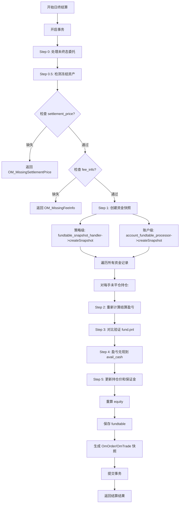

# 流程：日终结算（om_trading_day_end）

> 从 old_docs/modules/mod_core.md §4.3 和 overview.md §1.3.3 迁移  
> 入口：OmService::tradingDayEnd()

---

## 1. 流程概述



---

## 2. TradingDayEndService 实现结构

### 2.1 依赖注入设计

**TradingDayEndDeps 结构**：封装交易日结束所需的全部依赖

```
输入参数：
- trading_date：当前交易日

业务层 Processor：
- order_proc：用于处理未终态委托
- fund_snapshot：用于创建资金快照
- acct_fund_proc：用于账户级资金快照

缓存：
- price_cache：合约结算价缓存（code -> price）
- fee_cache：合约费率缓存（code -> FeeCodeInfo）

数据层 Store：
- fund_store / fund_his_store：策略级资金表
- acct_fund_store / acct_fund_his_store：账户级资金表
- pu_store / acct_pu_store：持仓单元表
- order_store / order_his_store：委托表
- trade_store / trade_his_store：成交表
- combo_store / combo_his_store：组合单元表
- cs_store / acct_cs_store：合约统计表

输出参数：
- out_has_pnl_mismatch：是否有结算盈亏误差
```

**约定**：run() 在已有事务内执行，不负责 begin/commit/rollback

### 2.2 六大步骤概览

| 步骤 | 方法名 | 职责 | 关键操作 |
|-----|-------|------|---------|
| Step 0 | `processNonTerminalOrders()` | 未终态委托处理 | 撤单、解冻资金/持仓 |
| Step 0.5 | `checkFrozenAssets()` | 冻结资产检测 | 仅日志告警 |
| Step 1 | `createFundSnapshots()` | 资金快照 | 策略级+账户级 |
| Step 2 | `validateCacheCompleteness()` | 缓存完整性校验 | 结算价+费率 |
| Step 3 | `settleStrategyFunds()` | 策略级结算 | 盈亏核对+逐手结算 |
| Step 4 | `settleAccountFunds()` | 账户级结算 | 类似策略级 |
| Step 5 | `archiveHistory()` | 历史归档 | order+trade+combo |

---

## 3. 详细步骤

**事务**：整个日终结算在单一事务内执行，调用方负责 beginTransaction/commit/rollback。

### Step 0：processNonTerminalOrders() - 未终态委托处理

日终结算前，对 order 表中所有**未终态委托**进行自动处理：

**未终态委托定义**（OrderStatus）：
- PendingNew (1) - 待报
- New (2) - 已报
- PartiallyFilled (3) - 部分成交
- PendingCancel (5) - 撤单待报
- Canceling (6) - 已报待撤

**处理逻辑**：

```
查询所有委托记录：
    对于每条非终态委托（PendingNew/New/PartiallyFilled/PendingCancel/Canceling）：
        如果 filled_volume == 0：
            status = CancelFilled（全撤）
            cancel_volume = volume
        否则如果 filled_volume < volume：
            status = PartiallyCanceled（部成部撤）
            cancel_volume = volume - filled_volume
        否则：
            跳过（异常情况）
        
        更新 update_time 和 finish_time
        
        如果是组合委托：
            直接 upsert 到 order 表
        否则（普通委托）：
            调用 OrderProcessor::process 处理撤单逻辑
            （开仓委托释放 frozen_cash，平仓委托释放 ContractStat.frozen）
```

**效果**：
- 开仓委托 → CancelFilled/PartiallyCanceled → 释放 `frozen_cash`
- 平仓委托 → CancelFilled/PartiallyCanceled → 释放 `ContractStat.frozen`

### Step 0.5：checkFrozenAssets() - 冻结资产检测

处理完未终态委托后，检测是否还存在冻结资金或冻结持仓：

```
1. 检测策略级冻结资金
   遍历所有 Fundtable 记录，检查 frozen_cash 是否为 0

2. 检测账户级冻结资金
   遍历所有 AccountFundtable 记录，检查 account_frozen 是否为 0

3. 检测策略级冻结持仓
   遍历所有 ContractStat 记录，检查 today/yesterday long/short frozen 是否均为 0

4. 检测账户级冻结持仓
   遍历所有 AccountContractStat 记录，检查 frozen 字段是否均为 0

以上任一项非零则记录 ERROR 日志（仅告警，不阻断结算）
```

**设计说明**：
- 仅打印 ERROR 日志，**不影响结算流程继续执行**
- 正常情况下不应检测到任何冻结资产
- 若检测到，说明处理逻辑存在缺陷或数据不一致

### Step 2：validateCacheCompleteness() - 缓存完整性校验

**处理流程**：

```
对于每个资金记录的作用域：
    查询该作用域全部未平仓持仓（PositionUnit）
    对于每个持仓单元：
        检查 price_cache 是否包含该合约代码
            缺失则返回 OM_MissingSettlementPrice
        检查 fee_cache 是否包含该合约代码
            缺失则返回 OM_MissingFeeInfo
```

### Step 1：createFundSnapshots() - 资金快照

**处理流程**：

```
1. 创建策略级资金快照
   调用 FundtableSnapshotHandler->createSnapshot()
   如果已存在则跳过（DupKey），其他错误返回

2. 创建账户级资金快照
   调用 AccountFundtableProcessor->createSnapshot()
   如果已存在则跳过，其他错误返回
```

### Step 3：settleStrategyFunds() - 策略级结算

**处理流程**：

```
对于每个策略级资金记录：
    1. 查询该作用域全部未平仓持仓（PositionUnit）
    
    2. 逐手计算结算盈亏
       settlement_pnl = Σ((settlement_price - hold_cost) × multiply × direction_sign)
    
    3. 盈亏核对
       pnl_diff = settlement_pnl - fund.pnl
       如果 |pnl_diff| > 0.0001元：
           标记盈亏不一致（仅告警，不阻断流程）
    
    4. 转移盈亏到可用资金
       fund.avail_cash += settlement_pnl
       fund.pnl = 0
    
    5. 逐手结算更新保证金
       对于每个持仓单元：
           new_margin = calcMargin(settlement_price, multiply, margin_ratio)
           margin_delta = new_margin - old_margin
           fund.avail_cash -= margin_delta  // 多退少补
           fund.margin += margin_delta
           更新持仓单元 hold_cost=settlement_price, margin=new_margin, pnl=0
    
    6. 更新权益
       fund.equity = fund.margin + fund.avail_cash + fund.frozen_cash + fund.pnl

最后统一更新所有资金记录到数据库
```

**设计特点**：
- 使用模板化实现（settleFundsImpl）复用于策略级和账户级结算
- 通过函数对象注入不同层级的资金操作（avail_cash vs account_cash）
- 盈亏核对超阈值仅记录日志，不阻断结算流程

### Step 4：settleAccountFunds() - 账户级结算

**处理流程**（与策略级类似，使用相同模板）：

```
对于每个账户级资金记录：
    1. 查询该账户下全部未平仓持仓（AccountPositionUnit）
    
    2. 逐手计算结算盈亏
    
    3. 转移盈亏到可用资金（account_cash += settlement_pnl）
       注意：账户级不做盈亏核对（传入 has_pnl_mismatch=nullptr）
    
    4. 逐手结算更新保证金（account_margin）
    
    5. 更新权益（account_equity）

最后统一更新所有账户资金记录到数据库
```

**与策略级的区别**：
- 操作 AccountFundtable/AccountPositionUnit
- 不做盈亏核对（调用方传入 nullptr）
- 使用 account_cash/account_margin 替代 avail_cash/margin

### Step 5：archiveHistory() - 历史归档

**处理流程**：

```
1. 委托历史归档
   查询 order 表全部记录
   批量插入到 order_his 表

2. 成交历史归档
   查询当日 trade 记录（按 trading_date）
   批量插入到 trade_his 表

3. 已拆解组合单元历史归档
   查询 existed_flag=0 的 CombinationUnit 记录
   批量插入到 combination_unit_his 表（带 trading_date）
```

---

## 4. 结算盈亏计算实现

### 4.1 逐手计算

```cpp
// last_price、hold_cost 已×10000，结果已为×10000，无需再除
settlement_pnl_per_lot = (settlement_price - hold_cost) × multiply × dir_sign
```

> **公式说明**：见 [`02-domain/fund-model.md`](../../02-domain/fund-model.md) §4.3 结算核心步骤

### 4.2 汇总与验证

```cpp
// 汇总
settlement_pnl = Σ(settlement_pnl_per_lot)

// 对比验证
pnl_diff = recalculated_pnl - fund.pnl
if |pnl_diff| > threshold (0.0001元):
    记录 ERROR 日志
    设置 has_pnl_mismatch = true
```

---

## 5. 持仓价与保证金更新

### 5.1 持仓价更新

```cpp
// 对每手未平仓 PositionUnit:
hold_cost = settlement_price
pnl = 0
```

### 5.2 保证金重算

```cpp
new_margin = calcMargin(settlement_price, multiply, margin_ratio)
margin_delta = new_margin - old_margin

// 多退少补
avail_cash -= margin_delta
margin += margin_delta
```

> **字段变化说明**：见 [`02-domain/fund-model.md`](../../02-domain/fund-model.md) §4.4 结算前后字段变化

---

## 6. 错误处理

| 错误点 | 错误码 | 处理策略 |
|--------|--------|----------|
| 缺少结算价 | OM_MissingSettlementPrice | 返回错误，不执行结算 |
| 缺少费率信息 | OM_MissingFeeInfo | 返回错误，不执行结算 |
| 盈亏对比不一致 | OM_SettlementPnlMismatch | 记录日志，继续完成结算 |
| 未终态委托处理失败 | OrderProcessor 错误码 | 返回错误，回滚事务 |
| 检测到剩余冻结资产 | 无（仅日志） | 打印 ERROR 日志，继续结算 |
| Store操作失败 | Store错误码 | LOG_ERROR，尝试继续 |
| settleFundsImpl 模板错误 | OM_InvalidArg | settleOneUnit 失败，返回错误 |

---

## 7. 实现细节补充

### 7.1 buildFeeInfoFromCache() - 费率信息构建

**逻辑**：当 fee_cache 中找不到该合约时，从委托字段构建默认 FeeCodeInfo（code、multiply、margin_ratio 从 order 复制），并记录 WARN 日志。

### 7.2 组合委托特殊处理

在 `processNonTerminalOrders()` 中，组合委托与普通委托的区别处理：

```
如果是组合委托（code 含 &）：
    直接 upsert 到 order 表
    理由：组合委托的持仓和资金变动已在拆腿时处理，无需再走 OrderProcessor

否则（普通委托）：
    从缓存构建 FeeCodeInfo（缺失时用委托字段兜底）
    调用 OrderProcessor::process 处理撤单逻辑（释放冻结资金/持仓）
```

---

## 8. 相关文档

| 主题 | 文档位置 | 层级 |
|------|---------|------|
| **结算模型定义** | [`02-domain/fund-model.md`](../../02-domain/fund-model.md) §4 日终结算 | L2 |
| **结算盈亏公式** | [`02-domain/calc-formulas.md`](../../02-domain/calc-formulas.md) §盈亏计算 | L2 |
| **保证金计算公式** | [`02-domain/calc-formulas.md`](../../02-domain/calc-formulas.md) §保证金计算 | L2 |
| **资金历史模型** | [`02-domain/fund-model.md`](../../02-domain/fund-model.md) §2 FundtableHis | L2 |
| **委托历史模型** | [`02-domain/order-lifecycle.md`](../../02-domain/order-lifecycle.md) §7 OrderHis | L2 |
| **成交历史模型** | [`02-domain/trade-lifecycle.md`](../../02-domain/trade-lifecycle.md) §10 TradeHis | L2 |
| **Processor接口** | [`03-implementation/interfaces/processor-apis.md`](../interfaces/processor-apis.md) | L3 |
| **资金模块架构** | [`01-architecture/module-core.md`](../../01-architecture/module-core.md) | L1 |
