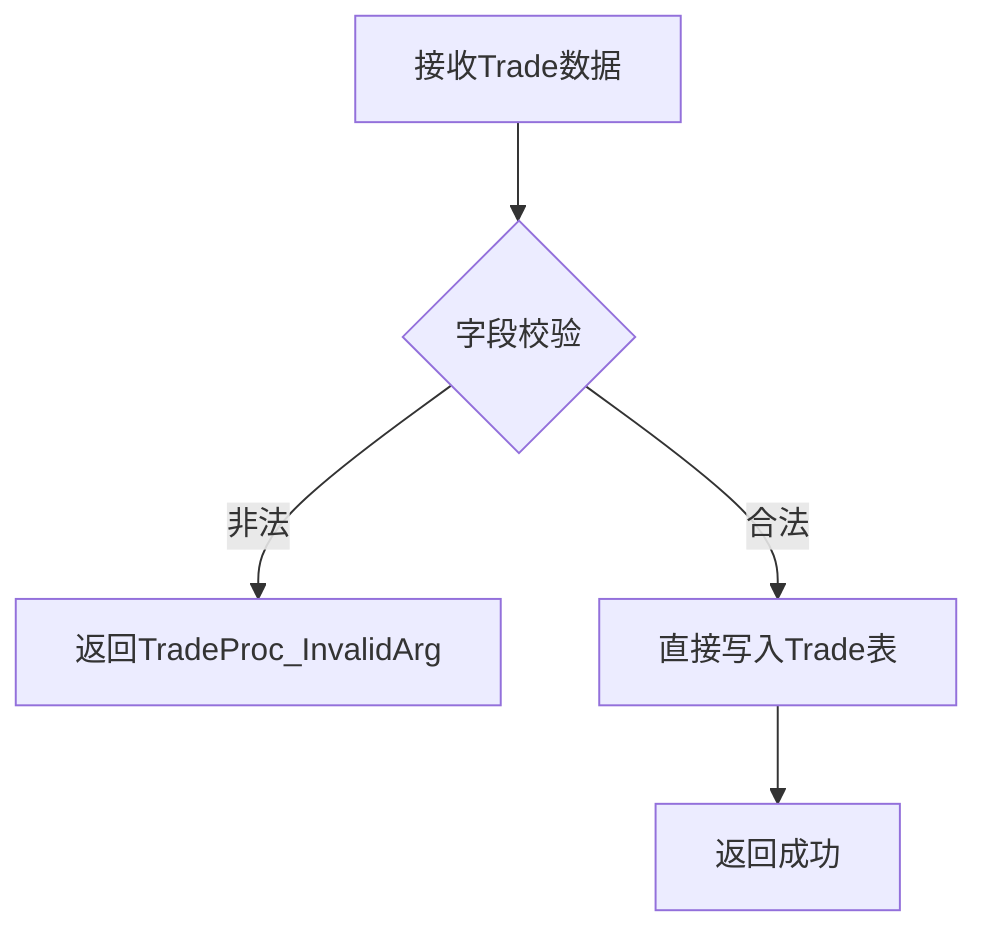
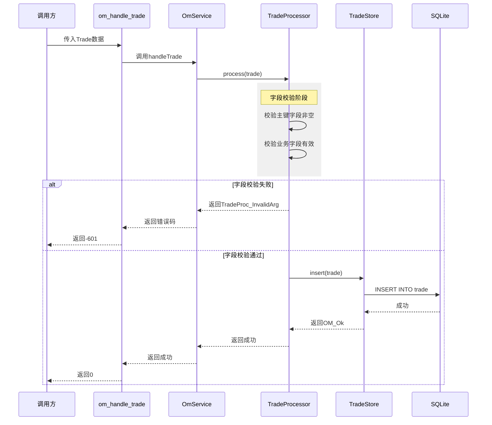
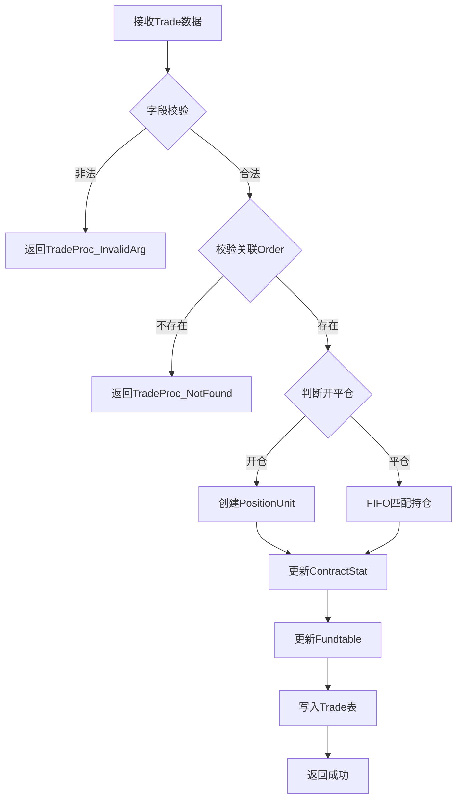

# 流程：OmTrade 成交处理

> OmTrade 数据接收、校验、入库的完整流程

---

## 1. 流程概述

### 1.1 当前版本定位

**重要说明**：当前版本Trade仅作为成交记录写入数据库，不参与持仓计算和资金计算，也不校验关联Order是否存在。

### 1.2 与 OmOrder 处理的对比

| 维度 | OmOrder处理 | OmTrade处理（当前） |
|------|-----------|------------------|
| 业务逻辑 | 驱动 Position → Fund 全链路计算 | 仅校验字段后直接入库 |
| OmOrder校验 | 必须存在 | 不校验 |
| 持仓更新 | 开仓/平仓计算 | 无 |
| 资金更新 | 冻结/保证金/手续费计算 | 无 |
| 事务包裹 | 是（OmOrder→Position→Fund） | 是（仅OmTrade入库） |

---

## 2. 流程图

### 2.1 简化流程图



### 2.2 详细时序图



---

## 3. 字段校验清单

### 3.1 主键字段校验（必须全部非空）

| 字段 | 校验规则 | 错误码 |
|------|----------|--------|
| order_id | strlen > 0 | TradeProc_InvalidArg |
| trade_date | > 0 | TradeProc_InvalidArg |
| strategy_id | strlen > 0 | TradeProc_InvalidArg |
| run_id | strlen > 0 | TradeProc_InvalidArg |
| account_id | strlen > 0 | TradeProc_InvalidArg |
| account_type | >= 0 | TradeProc_InvalidArg |
| match_seqno | strlen > 0 | TradeProc_InvalidArg |

### 3.2 业务字段校验

| 字段 | 校验规则 | 错误码 |
|------|----------|--------|
| code | strlen > 0 | TradeProc_InvalidArg |
| side | 属于有效OrderSide枚举值 | TradeProc_InvalidArg |
| volume | > 0 | TradeProc_InvalidArg |
| price | > 0 | TradeProc_InvalidArg |

---

## 4. 关键代码路径

### 4.1 入口函数

```cpp
// include/om_manager_api.h
OM_API int om_handle_trade(OmTrade trade);
```

### 4.2 调用链

```
om_handle_trade()
    ↓
OmService::handleTrade()
    ↓
TradeProcessor::process()
    ↓
TradeStore::insert()
```

---

## 5. 错误码汇总

| 错误码 | 值 | 触发阶段 | 说明 |
|--------|-----|----------|------|
| OM_Ok | 0 | - | 成功 |
| OM_NotInited | -8 | 入口检查 | 系统未初始化 |
| OM_InvalidArg | -1 | 入口检查 | 参数非法（trade结构体为空） |
| TradeProc_InvalidArg | -601 | 字段校验 | 字段缺失或无效 |
| TradeProc_StoreError | -603 | 入库阶段 | 数据库操作失败 |
| TradeProc_DuplicateKey | -604 | 入库阶段 | 主键重复（重复成交） |

---

## 6. 未来扩展预留

当需要Trade驱动持仓和资金计算时，流程将扩展为：



**预留扩展点**：
- 关联Order校验（用于确认委托存在性）
- 开仓处理：创建PositionUnit，更新ContractStat，冻结保证金
- 平仓处理：FIFO匹配持仓，释放保证金，计算实现盈亏
- 资金更新：手续费扣除，保证金占用，权益重算

---

## 7. 相关文档

| 主题 | 位置 |
|------|------|
| Trade字段定义 | `02-domain/trade-lifecycle.md` |
| Trade表结构 | `02-domain/trade-lifecycle.md` §9 |
| TradeStore接口 | `03-implementation/interfaces/store-apis.md` §2 |
| 对外API定义 | `03-implementation/interfaces/public-apis.md` §3.3 |
| Order处理流程 | `03-implementation/flows/order-flow.md` |
